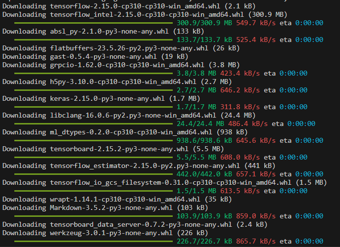

# Tugas 1
Rofi Nafiis Zain - 1214017
## Install Tensorflow
1. Pastikan device anda memiliki python untuk menginstall library tensorflow
2. kemudian buka terminal dan jalankan perintah berikut
	```
	$ pip install tensorflow
	```
3. Maka tampilan terminal akan berubah seperti berikut ini:
    
4. Jika sudah terinstall maka tampilan pada terminal akan menjadi seperti pada gambar berikut ini:
5. Jika sudah selesai download pada terminal maka Tensorflow sudah bisa digunakan.

## Tugas

1. Repository fork [rofinafiin/nlp-ai](https://github.com/rofinafiin/nlp-ai)
2. Buka project dengan IDE yang dimiliki (disarankan menggunakan [Visual Studio Code](https://code.visualstudio.com/download)
3. Install Requirements.txt dengan perintah:
	```python
	$ pip install -r requirements.txt
	```
4. Jalankan preprocessing.py dengan perintah
	```python
	$ python preprocessing.py
	```
5. Maka hasil dari preprocessing.py akan membuat file [clean_qa.txt]()
6. Tampilan pada terminal seperti gambar berikut:
7. Jalankan training.py, kemudian tunggu sampai proses selesai

### Pre-processing
